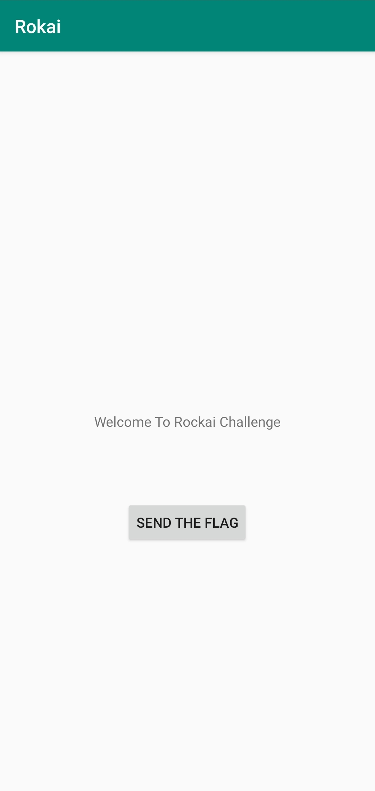
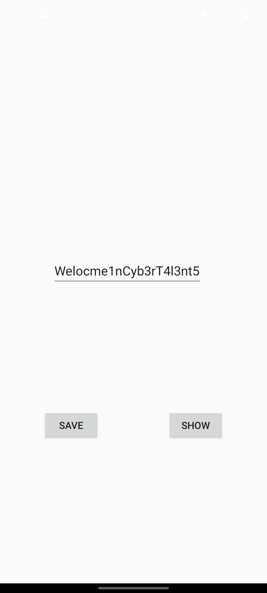
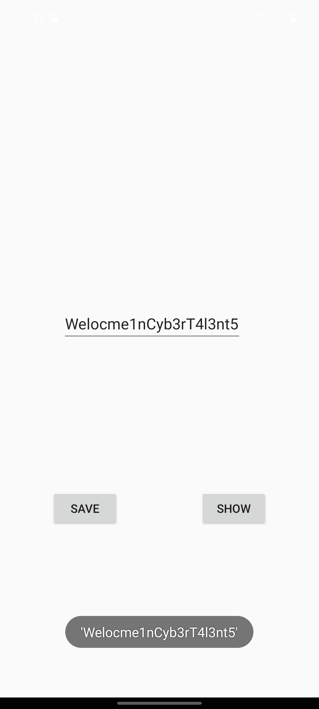
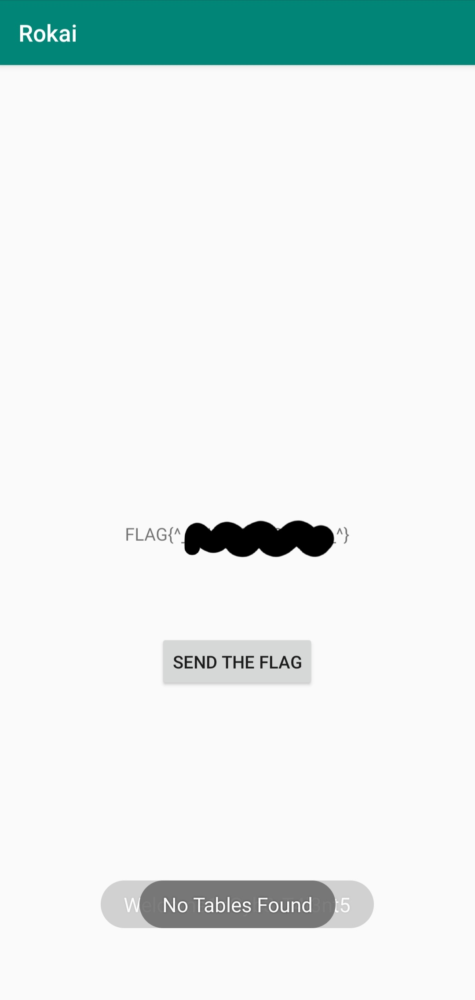

# Rokai challange

**Category:** Malware Reverse Engineering   **Level:** medium   **Points:** 100

apk: [If you don't like the road you're walking, start paving another one.](https://hubchallenges.s3-eu-west-1.amazonaws.com/Reverse/Rokai492084659892759472878.apk)



> first of all the discription indicates us that there is something missing and needs to provided, let's see what that thing is.
>  
> there are more than one way for the solution i'll explain the way i used.

**tools:**

* [dex2jar](https://github.com/pxb1988/dex2jar)
* [JD-GUI](http://java-decompiler.github.io/)
* [apk studio](https://github.com/vaibhavpandeyvpz/apkstudio)
* [android studio](https://developer.android.com/studio/)
  
i tried to reverse the app firt from the smali output i get from apktool but it not the better way for a noob like me.
then i tried abother way, i converted apk to jar to see what code does easily

```sh
$ d2j-dex2jar -f Rokai492084659892759472878.apk
```

then i opend the jar file with java decompiler **JD-GUI**

here's the content of the MainActivity:

```java
public class MainActivity extends AppCompatActivity {
  static {
    System.loadLibrary("native-lib");
  }
  
  protected void onCreate(Bundle paramBundle) {
    super.onCreate(paramBundle);
    setContentView(2131296284);
    ((TextView)findViewById(2131165282)).setText("Welcome To Rockai Challenge");
    ((Button)findViewById(2131165218)).setOnClickListener(new View.OnClickListener() {
          public void onClick(View param1View) {
            try {
              Cursor cursor = MainActivity.this.getContentResolver().query(Uri.parse("content://com.rokai2.contentprovider/pwd"), (String[])null, (String)null, (String[])null, (String)null);
              if (cursor.moveToFirst()) {
                if (cursor.getString(cursor.getColumnIndex("pwd")) == "Welocme1nCyb3rT4l3nt5") {
                  TextView textView = (TextView)MainActivity.this.findViewById(2131165282);
                  String str = MainActivity.this.stringFromJNI(cursor.getString(cursor.getColumnIndex("pwd")));
                  if (str.startsWith("FLAG{"))
                    textView.setText(str); 
                } 
                Toast.makeText(MainActivity.this.getApplicationContext(), cursor.getString(cursor.getColumnIndex("pwd")), 0).show();
              } 
              Toast.makeText(MainActivity.this.getApplicationContext(), "No Tables Found", 0).show();
            } catch (Exception exception) {
              Toast.makeText(MainActivity.this.getApplicationContext(), "Sorry We did not find the provider!!", 0).show();
            } 
          }
        });
  }
  
  public native String stringFromJNI(String paramString);
}
```

the source code is clear now, just a simple app with `textview` and `button` when you click the button it will call the column `pwd` from `content://com.rokai2.contentprovider/pwd` then will get the *pwd* string value and if it fails it will show this Message `"Sorry We did not find the provider!!"` and if it finds the data will compare it with this string `"Welocme1nCyb3rT4l3nt5"` and then call our FLAG with the native library `stringFromJNI()` then tha flag will appear in the text view `textView.setText(str);`

at this moment and after searching for what content provider is we know what to do. 
if you don't know what content provider is, it's just an android api that enable apps to share their own data or to access the data from other apps, such as the Contacts app.


from analyzing the Rokai app and looking at its AndroidManifest.xml file i found that the app doesn't contain any content providers, so we need to make it.

i made a [simple app](./ContentProviders) that makes an exported contentprovider `content://com.rokai2.contentprovider/pwd` to be accessible for the Rokai app, then i made a database with one STRING column `pwd`,the app ui contains two buttons `save` and `show` and one `text input` for pwd input to be saved in the contentprovider database and in our case this input will be `"Welocme1nCyb3rT4l3nt5"`.

> [arabic explaination for making content provider app](https://www.youtube.com/watch?v=-oZlj1tugLQ)

 )

after that i opend Rokai, the app found the provider but didn't get the flag, i looked at the code one more time then i found that it compares the string with `==` in java means comparing with the reference not with the string itself, which means our content provider string not equal `"Welocme1nCyb3rT4l3nt5"`, so we need to pass this condition

```java
if (cursor.getString(cursor.getColumnIndex("pwd")) == "Welocme1nCyb3rT4l3nt5")
```

so we need to modify the apk
by using APK studio and opening *smali/com/Rokai/cybertalents/MainActivity$1.smali* i found that this instruction `if-nq v2, v3, :cond_0` is the one that changing the app flow

```smali
   ........
    const-string v3, "Welocme1nCyb3rT4l3nt5"

    if-nq v2, v3, :cond_0

    .line 41
   ........
```

by changing it from `if-nq` to `if-eq` we will pass the if condition

now lets build the app from apk studio by `project > build` or from command line

```sh
$ apktool b Rokai/
```

the modified apk stored in Rokai/dist/
i needed no resign the apk to be able to install it 

```sh
$ keytool -genkey -v -keystore my-release-key.keystore -alias alias_name -keyalg RSA -keysize 2048 -validity 10000
$ jarsigner -verbose -sigalg SHA1withRSA -digestalg SHA1 -keystore my-release-key.keystore dist/Rokai.apk alias_name
```

after instaling the modefied Rokai.apk and try again i get the flag.


